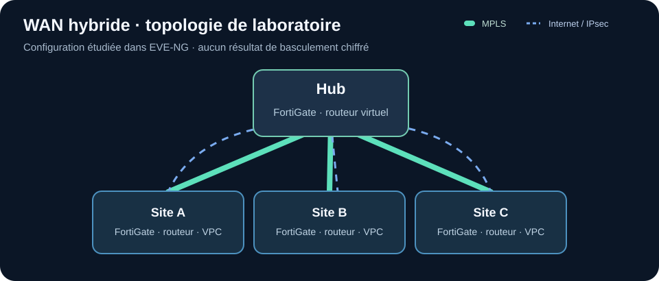
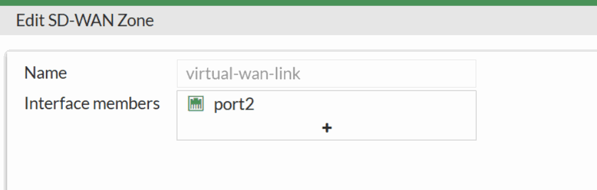

# Architecture WAN hybride MPLS et SD-WAN

**Projet académique en binôme à l'ENSA Kénitra (2024–2025), avec Chaima El-Achouri et Ihssane Zaoui.** Nous avons construit une maquette multi-sites dans EVE-NG. Aucun équipement d'entreprise ou réseau opérateur réel n'a été modifié.

## But du projet

Étudier comment relier un site central et trois sites distants au moyen d'un transport MPLS et d'un chemin Internet, avec routage, tunnels IPsec et politiques SD-WAN. Le secours en cas de panne était un **objectif d'architecture** à tester, pas un résultat de disponibilité mesuré.

## Problématique

Un seul chemin WAN peut rendre les sites indisponibles lorsqu'il tombe. Ajouter un second lien ne suffit pas : il faut configurer les routes, les tunnels et les règles du pare-feu, puis vérifier quel chemin porte réellement le trafic. Comment assembler ces couches dans une maquette et distinguer connectivité de base et basculement validé ?

## Ce que nous avons fait et pourquoi

| Travail du rapport | Pourquoi | Preuve disponible |
| --- | --- | --- |
| Topologie hub/spoke sur EVE-NG, quatre FortiGate, quatre routeurs virtuels Cisco et des postes VPC | Reproduire les sites et les deux chemins de transport | Schéma et captures de laboratoire |
| Interfaces, MPLS/LDP et configuration BGP sur les routeurs | Acheminer les préfixes requis entre les réseaux de test | Extraits de configuration |
| Zone SD-WAN, membres et politiques sur les FortiGate | Préparer une sélection des liaisons selon les besoins | Capture de configuration de la zone |
| Tunnels IPsec `VPN-INET` et `VPN-MPLS` avec phases 1 et 2 | Préparer la protection et l'interconnexion des sites | Captures de paramètres, sans mesure de stabilité |
| Vérifications ICMP entre postes, passerelles et routeurs | Confirmer une partie des chemins avant des essais plus exigeants | Réponses ping capturées dans le rapport |

## Résultat et limites

La topologie, ses principales configurations et **des échanges ICMP réussis sur les cibles testées** sont documentés. Le rapport ne donne ni séquence reproductible de coupure d'un lien, ni temps de convergence, ni mesure d'une application entre tous les sites : je ne présente donc pas une haute disponibilité démontrée. OSPF est décrit dans l'état de l'art, mais son déploiement complet n'est pas confirmé par les extraits accessibles.

[Lire la méthodologie : construction, contrôles effectués et tests de bascule à mener](METHODOLOGIE.md).

**Confidentialité :** le PDF académique d'origine reste dans ce dépôt et comporte un plan d'adressage et une clé de laboratoire. Les nouveaux extraits ne reprennent pas ces valeurs ; les propositions cryptographiques du TP ne doivent pas être reprises en production.
